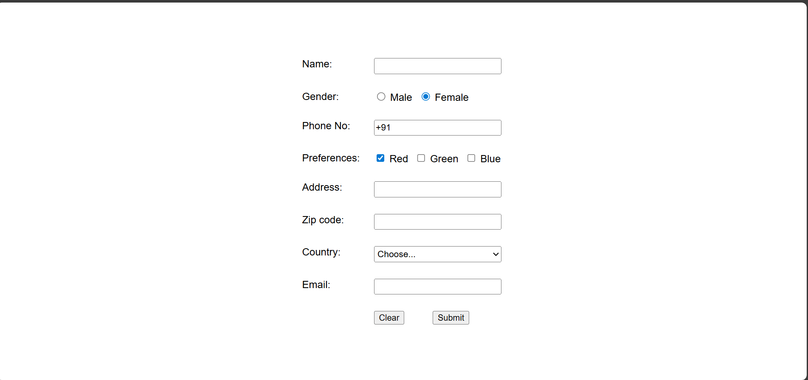
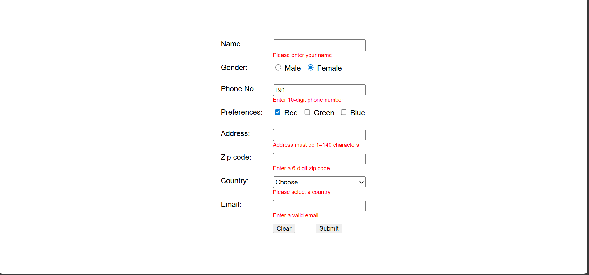
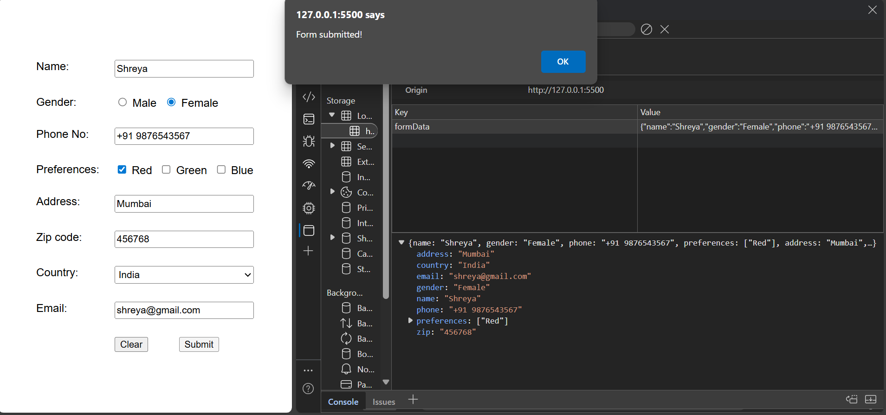

# Form ✨

A simple and interactive web form built with HTML, CSS, and JavaScript. This project demonstrates form validation and localStorage usage.

## 🚀 Features

- ✅ Real-time input validation
- 💾 Save form data to localStorage
- 🔁 Load and edit previously saved entries
- 🧹 Reset and clear form data
- 🌐 No frameworks used – pure HTML, CSS, and JavaScript

## 🛠️ Tech Stack

- HTML
- CSS
- JavaScript (vanilla)

## 📸 Screenshots

### 🧾 Default Form View
This is how the form looks when the page first loads.

---

### ❌ Validation Errors
Displays real-time error messages if inputs are invalid or missing.

---

### ✅ Form Submission & Local Storage
After successful validation, data is saved in localStorage and shown in the browser's DevTools.

